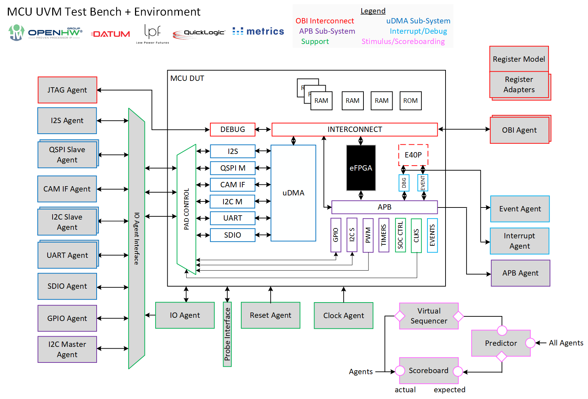

# About
This project aims to bring the [OpenHW Group](https://www.openhwgroup.org/)'s [CORE-V MCU Project](https://docs.openhwgroup.org/projects/core-v-mcu/index.html) to [TRL-5](https://www.nasa.gov/directorates/heo/scan/engineering/technology/technology_readiness_level) and beyond via [Advanced UVM Verification](https://www.linkedin.com/pulse/advanced-uvm-brian-hunter/) and the [Moore.io](https://mooreio.org/) libraries and toolchain. [Datum](https://datumtc.ca/) and [Low Power Futures](https://lowpowerfutures.com/) are the primary contributors to this effort.

[](https://docs.google.com/presentation/d/1iDyMnr6qHctas9Ce_29tlLaOn_mJ5B11AzqFdvYi0zA/edit?usp=sharing)


# IP List
 Name | Description
 -----|------------
 [`uvme_cvmcu`](dv/uvme_cvmcu) | CORE-V MCU Top-Level Environment
 [`uvmt_cvmcu`](dv/uvmt_cvmcu) | CORE-V MCU Top-Level Test Bench
 [`uvme_apb_adv_timer`](dv/uvme_apb_adv_timer) | APB Advanced Timer Sub-System Environment
 [`uvme_apb_timer`](dv/uvme_apb_timer) | APB Timer Sub-System Environment
 [`uvmt_apb_adv_timer`](dv/uvmt_apb_adv_timer) | APB Advanced Timer Sub-System Test Bench
 [`uvmt_apb_timer`](dv/uvmt_apb_timer) | APB Timer Sub-System Test Bench


# Installing Toolchain
1. Download and install the latest version of [Xilinx Vivado ML Edition](https://www.xilinx.com/support/download.html)
1. Set an environment variable for the Vivado installation location: `export MIO_VIVADO_HOME=/path/to/vivado/bin`
1. Set an environment variable for the Metrics installation location: `export MIO_METRICS_HOME=/usr/local/bin`
1. Install the [Moore.io CLI Client](https://mio-cli.readthedocs.io/en/latest/): `pip3 install mio-cli`
1. [Create a free Moore.io IP Marketplace user account](https://mooreio.org/account/register). The VIP libraries for this project are under license from [Datum](https://datumtc.ca/) and credentials are needed to install them.

## Supported Simulators
- Xilinx Vivado: `2022.2`
- Metrics DSim: `20220822.10.0`
- Siemens QuestaSim: ETA Q4 '22
- Synopsys VCS: ETA Q1 '23
- Cadence Xcelium: ETA Q1 '23
- Aldec Riviera-PRO: TBD


# Simulation
To run compilation, elaboration and simulation for IP `uvmt_cvmcu`, test `reg_bit_bash`, seed `1`, `high` verbosity, with waveform capture enabled, using the Vivado simulator:

```
mio sim uvmt_cvmcu -t reg_bit_bash -s 1 -v high -w -a viv
```

# Regressions
To run regression `sanity` for IP `uvmt_cvmcu`:

```
mio regr uvmt_cvmcu sanity
```
