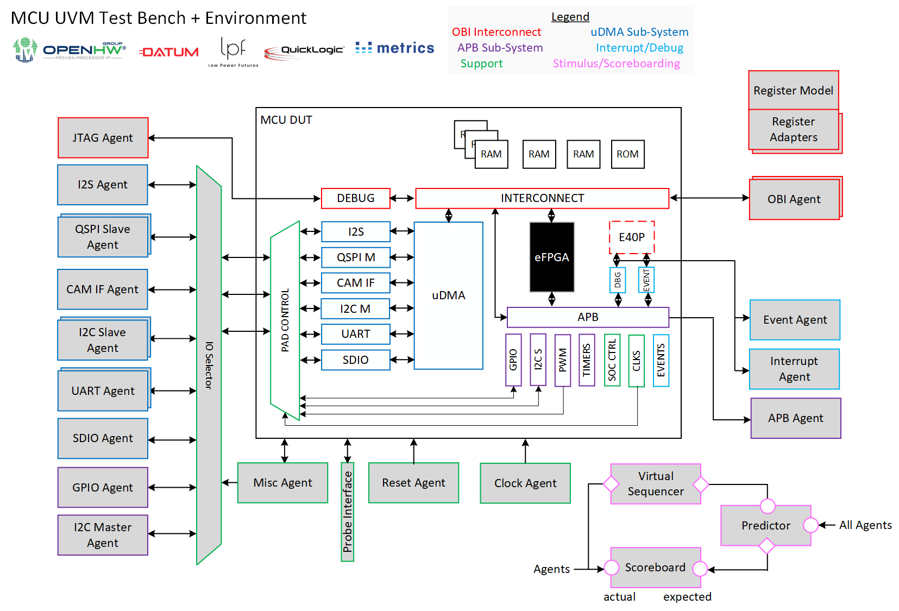

# About
This project aims to bring the [OpenHW Group](https://www.openhwgroup.org/)'s [CORE-V MCU Project](https://docs.openhwgroup.org/projects/core-v-mcu/index.html) to [TRL-5](https://www.nasa.gov/directorates/heo/scan/engineering/technology/technology_readiness_level) and beyond via [Advanced UVM Verification](https://www.linkedin.com/pulse/advanced-uvm-brian-hunter/) and the [Moore.io](https://mooreio.org/) libraries and toolchain. [Datum](https://datumtc.ca/) and [Low Power Futures](https://lowpowerfutures.com/) are the primary contributors to this effort.

[](https://docs.google.com/presentation/d/1iDyMnr6qHctas9Ce_29tlLaOn_mJ5B11AzqFdvYi0zA/edit?usp=sharing)


# IP List
 Name | Description
 -----|------------
 [`uvme_cvmcu_chip`](dv/chip/uvme_cvmcu_chip) | CORE-V MCU Top-Level Environment
 [`uvmt_cvmcu_chip`](dv/chip/uvmt_cvmcu_chip) | CORE-V MCU Top-Level Test Bench
 [`uvme_apb_adv_timer_ss`](dv/ss/uvme_apb_adv_timer_ss) | APB Advanced Timer Sub-System Environment
 [`uvme_apb_timer_ss`](dv/ss/uvme_apb_timer_ss) | APB Timer Sub-System Environment
 [`uvmt_apb_adv_timer_ss`](dv/ss/uvmt_apb_adv_timer_ss) | APB Advanced Timer Sub-System Test Bench
 [`uvmt_apb_timer_ss`](dv/ss/uvmt_apb_timer_ss) | APB Timer Sub-System Test Bench


# Installing Toolchain
1. [Create a free Moore.io IP Marketplace user account](https://mooreio.org/account/register). The VIP libraries for this project are under license from [Datum](https://datumtc.ca/) and credentials are needed to install them.
1. Install the [Moore.io CLI Client](https://mio-cli.readthedocs.io/en/latest/): `pipx install mio-cli`
1. Download and install the latest version of [Metrics DSim Cloud](https://support.metrics.ca/hc/en-us/articles/9644829166989-Installing-the-DSim-Cloud-CLI-Tool)
1. Set an environment variable for the MDC installation location: `export MIO_METRICS_HOME=/usr/local/bin`
1. Download and install the latest version of [Xilinx Vivado ML Edition](https://www.xilinx.com/support/download.html)
1. Set an environment variable for the Vivado installation location: `export MIO_VIVADO_HOME=/path/to/vivado/bin`

## Supported Simulators
- Metrics DSim Cloud: `20230116.4.0`
- Xilinx Vivado: `2022.2`
- Siemens QuestaSim: ETA Q1 '23
- Synopsys VCS: ETA Q1 '23
- Cadence Xcelium: ETA Q1 '23
- Aldec Riviera-PRO: TBD


# Getting the MCU RTL
The MCU RTL is included as a git submodule; if you do not clone the repository with `--recursive`, you will have to populate the submodule(s) manually:
```
git submodule update --init
```


# Simulation
- The UVM libraries from Datum must first be installed:

> ```
> mio install uvmt_cvmcu_chip
> ```

- To run compilation, elaboration and simulation for IP `uvmt_cvmcu_chip`, test `reg_bit_bash`, seed `1`, `high` verbosity, with waveform capture enabled, using Metrics DSim Cloud simulator:

> ```
> mio sim uvmt_cvmcu_chip -t reg_bit_bash -s 1 -v high -w -a mdc
> ```

- To run compilation, elaboration and simulation for IP `uvmt_apb_timer_ss`, test `reg_hw_reset`, seed `1`, `high` verbosity, with waveform capture enabled, using the Vivado simulator:

> ```
> mio sim uvmt_apb_timer_ss -t reg_hw_reset -s 1 -v high -w -a viv
> ```

# Regressions
## Running locally
To run regression `sanity` for IP `uvmt_cvmcu_chip` using the Metrics DSim Cloud simulator:

```
mio regr uvmt_cvmcu_chip sanity -a mdc
```

## Reports

| IP | Sanity | Nightly | Weekly |
|----| ------ | ------- | ------ |
| uvmt_cvmcu_chip | Coming Soon | Coming Soon | Coming Soon |
| uvmt_apb_timer_ss | [Tests](https://hdl.io/regressions/mcu_sanity/uvmt_apb_timer_sanity.html) | [Tests](https://hdl.io/regressions/mcu_nightly/uvmt_apb_timer_nightly.html) | [Tests](https://hdl.io/regressions/mcu_weekly/uvmt_apb_timer_weekly.html) |
| uvmt_apb_adv_timer_ss | [Tests](https://hdl.io/regressions/mcu_sanity/uvmt_apb_adv_timer_sanity.html) | [Tests](https://hdl.io/regressions/mcu_nightly/uvmt_apb_adv_timer_nightly.html) | [Tests](https://hdl.io/regressions/mcu_weekly/uvmt_apb_adv_timer_weekly.html) |


