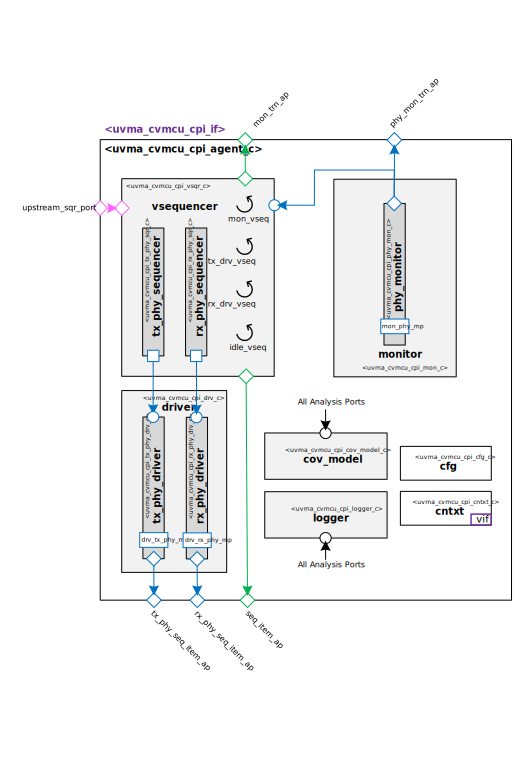

@mainpage IP Information
@htmlonly

@endhtmlonly

@tableofcontents

@section uvma_cvmcu_cpi_license_agreement License Agreement
© Copyright 2023 Acme Enterprises

All rights reserved.

@section uvma_cvmcu_cpi_ip_desc IP Description
This IP contains the acme CORE-V-MCU Camera Parallel Interface UVM Agent.

@section uvma_cvmcu_cpi_ip_documents Documents
ID | Name | Version
-- | ---- | -------
001 | @subpage uvma_cvmcu_cpi_user_guide "User Guide" | 1.0
002 | @subpage uvma_cvmcu_cpi_dev_guide "Developer Guide" | 1.0

@section uvma_cvmcu_cpi_ip_ref Reference
 * @ref uvma_cvmcu_cpi_pkg
   * @ref uvma_cvmcu_cpi_seq
   * @ref uvma_cvmcu_cpi_obj
   * @ref uvma_cvmcu_cpi_comps
   * @ref uvma_cvmcu_cpi_misc

@section uvma_cvmcu_cpi_release_history Release History
@subsection uvma_cvmcu_cpi_v1_0_0 2023// - 1.0.0
- Initial release

@htmlonly

@endhtmlonly