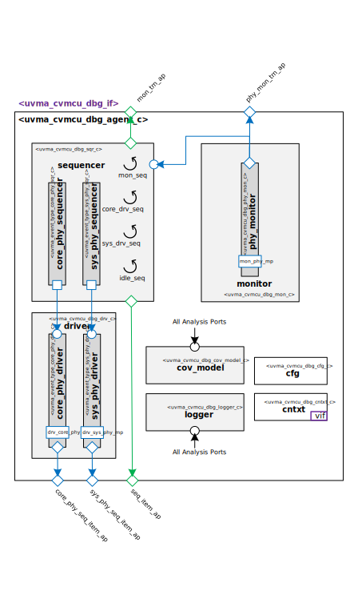

@mainpage IP Information
@htmlonly

@endhtmlonly

@tableofcontents

@section uvma_cvmcu_dbg_license_agreement License Agreement
© Copyright 2023 Acme Enterprises

All rights reserved.

@section uvma_cvmcu_dbg_ip_desc IP Description
This IP contains the acme CORE-V-MCU Debug Interface UVM Agent.

@section uvma_cvmcu_dbg_ip_documents Documents
ID | Name | Version
-- | ---- | -------
001 | @subpage uvma_cvmcu_dbg_user_guide "User Guide" | 1.0
002 | @subpage uvma_cvmcu_dbg_dev_guide "Developer Guide" | 1.0

@section uvma_cvmcu_dbg_ip_ref Reference
 * @ref uvma_cvmcu_dbg_pkg
   * @ref uvma_cvmcu_dbg_seq
   * @ref uvma_cvmcu_dbg_obj
   * @ref uvma_cvmcu_dbg_comps
   * @ref uvma_cvmcu_dbg_misc

@section uvma_cvmcu_dbg_release_history Release History
@subsection uvma_cvmcu_dbg_v1_0_0 2023// - 1.0.0
- Initial release

@htmlonly

@endhtmlonly