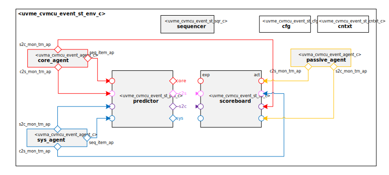

# Datum Technology Corporation CORE-V-MCU Event Interface UVM Agent Self-Test Environment

# About
This IP contains the Datum Technology Corporation CORE-V-MCU Event Interface UVM Agent Self-Test Environment.

# Block Diagram

# Directory Structure
* `bin` - Scripts, metadata and other miscellaneous files
* `docs` - Documents describing the CORE-V-MCU Event Interface UVM Agent Self-Test Environment
* `examples` - Code samples for using and extending this environment
* `src` - Source code

# Dependencies
It is dependent on the following IP:

* `datum/uvmx`
* `datum/uvml_sb`
* `datum/uvma_cvmcu_event`