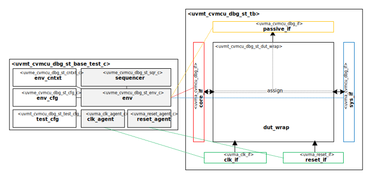

# Datum Technology Corporation CORE-V-MCU Debug Interface UVM Agent Self-Test Bench

# About
This IP contains the Datum Technology Corporation CORE-V-MCU Debug Interface UVM Agent Self-Test Bench.

# Block Diagram

# Directory Structure
* `bin` - Scripts, metadata and other miscellaneous files
* `docs` - Documents describing the CORE-V-MCU Debug Interface UVM Agent Self-Test Bench
* `examples` - Code samples for extending this Test Bench
* `src` - Source code

# Dependencies
It is dependent on the following IP:

* `datum/uvmx`
* `datum/uvme_cvmcu_dbg_st`