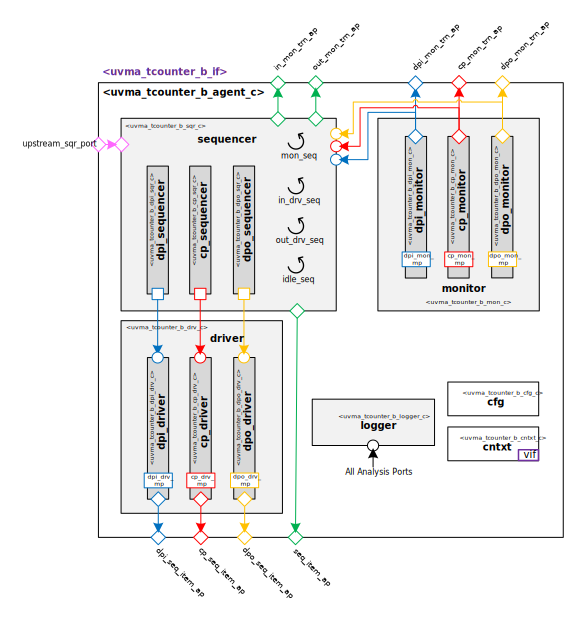

@mainpage IP Information
@htmlonly

@endhtmlonly

@tableofcontents

@section uvma_tcounter_b_license_agreement License Agreement
© Copyright 2023 Datum Technology Corporation

All rights reserved.

@section uvma_tcounter_b_ip_desc IP Description
This IP contains the datum Timer unit counter Block UVM Agent.

@section uvma_tcounter_b_ip_documents Documents
ID | Name | Version
-- | ---- | -------
001 | @subpage uvma_tcounter_b_user_guide "User Guide" | 1.0
002 | @subpage uvma_tcounter_b_dev_guide "Developer Guide" | 1.0

@section uvma_tcounter_b_ip_ref Reference
 * @ref uvma_tcounter_b_pkg
   * @ref uvma_tcounter_b_seq
   * @ref uvma_tcounter_b_obj
   * @ref uvma_tcounter_b_comps
   * @ref uvma_tcounter_b_misc

@section uvma_tcounter_b_release_history Release History
@subsection uvma_tcounter_b_v1_0_0 2023/12/12 - 1.0.0
- Initial release

@htmlonly

@endhtmlonly