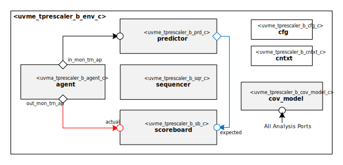

@mainpage IP Information
@htmlonly

@endhtmlonly

@tableofcontents

@section uvme_tprescaler_b_license_agreement License Agreement
© Copyright 2023 Datum Technology Corporation

All rights reserved.

@section uvme_tprescaler_b_ip_desc IP Description
This IP contains the datum Timer unit prescaler Block UVM Environment.

@section uvme_tprescaler_b_ip_documents Documents
ID | Name | Version
-- | ---- | -------
001 | @subpage uvme_tprescaler_b_user_guide "User Guide" | 1.0
002 | @subpage uvme_tprescaler_b_dev_guide "Developer Guide" | 1.0

@section uvme_tprescaler_b_ip_ref Reference
 * @ref uvme_tprescaler_b_pkg
   * @ref uvme_tprescaler_b_seq
   * @ref uvme_tprescaler_b_obj
   * @ref uvme_tprescaler_b_comps
   * @ref uvme_tprescaler_b_misc

@section uvme_tprescaler_b_release_history Release History
@subsection uvme_tprescaler_b_v1_0_0 2023/8/5 - 1.0.0
- Initial release

@htmlonly

@endhtmlonly