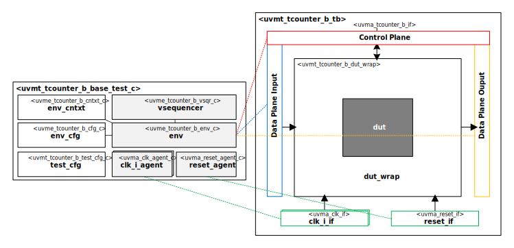

# datum  Block UVM Test Bench

## About
This IP contains the datum  Block UVM Test Bench.

## Block Diagram

## Directory Structure
* `bin` - Scripts, metadata and other miscellaneous files
* `docs` - Reference documentation
* `examples` - Code samples for adding to this test bench
* `src` - Source code root

> * `tb` - Test Bench
> * `tests` - UVM Tests and Test Suites

## Dependencies
It is dependent on the following IP:

* `datum/uvmx`
* `datum/uvma_clk`
* `datum/uvma_reset`
* `uvma_tcounter_b]`
* `uvme_tcounter_b]`