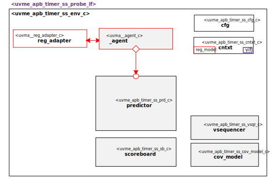

@mainpage IP Information
@htmlonly

@endhtmlonly

@tableofcontents

@section license_agreement License Agreement
© Copyright 2023 Datum Technology Corporation

All rights reserved.

@section ip_desc IP Description
This IP contains the Datum Technology Corporation APB simple timer unit Sub-System UVM Environment.
TODO Describe APB simple timer unit Sub-System UVM Environment

@section ip_documents Documents
ID | Name | Version
-- | ---- | -------
001 | @subpage quick_start_guide "Quick Start Guide" | v.1.0
002 | @subpage user_guide "User Guide" | v.1.0

@section ip_ref Reference
 * @ref uvme_apb_timer_ss_comps
 * @ref uvme_apb_timer_ss_obj
 * @ref uvme_apb_timer_ss_seq
 * @ref uvme_apb_timer_ss_reg
 * @ref uvme_apb_timer_ss_misc
 * @ref uvme_apb_timer_ss_pkg Typedefs

@section release_history Release History
@subsection v_1_0_0 2023/01/01 - v.1.0.0
- Initial release

@htmlonly

@endhtmlonly