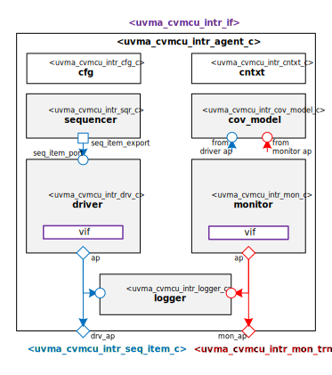

# Hello from your Code Generator!
Thank you for using the Moore.io Basic UVM Agent Code Template v1.0!

Your parameters are:
* Name: 'cvmcu_intr'
* Full Name: 'CORE-V MCU Interrupt'

If this is incorrect, it is recommended to delete the generated IP and re-generate with the correct parameters.

What follows is a short guide for developers of this new UVM Agent. You may also use `grep -nr TODO .` for a full list.

 1. - [ ] Physical Interface - `uvma_{{ name }}_if.sv` - Modify the signals to match your protocol's physical interface.
 1. - [ ] Monitor Transaction - `obj/uvma_{{ name }}_phy_mon_trn.sv` - Modify the fields to match your interface definition.
 1. - [ ] Sequence Item - `seq/uvma_{{ name }}_phy_seq_item.sv` - Modify the fields to match your interface definition.
 1. - [ ] Driver - `comps/uvma_{{ name }}_phy_drv.sv` - Modify the code driving the modport signals to match your interface definition.
 1. - [ ] Monitor - `comps/uvma_{{ name }}_mon.sv` - Modify the code sampling the modport signals to match your interface definition.

## Have fun!
Make sure to check out the other IP generated along with this test bench:
* `uvme_cvmcu_intr_st`
* `uvmt_cvmcu_intr_st`

# Datum Technology Corporation CORE-V MCU Interrupt UVM Agent

# About
This package contains the Datum Technology Corporation CORE-V MCU Interrupt UVM Agent.
TODO Describe CORE-V MCU Interrupt

# Block Diagram

# Directory Structure
* `bin` - Scripts, metadata and other miscellaneous files
* `docs` - Reference documentation
* `examples` - Code samples for using and extending this agent
* `src` - Source code

# Dependencies
It is dependent on the following packages:

* `uvm_pkg`
* `uvml_pkg`
* `uvml_logs_pkg`
