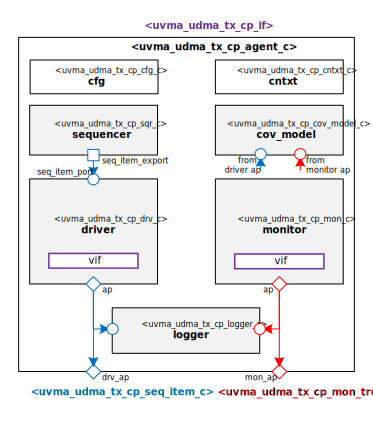

@mainpage IP Information
@htmlonly

@endhtmlonly

@tableofcontents

@section license_agreement License Agreement
© Copyright 2022 Datum Technology Corporation

SPDX-License-Identifier: Apache-2.0 WITH SHL-2.1

@section ip_desc IP Description
This IP contains the Datum Technology Corporation uDMA Tx Channels Block Control Plane UVM Agent.
TODO Describe uDMA Tx Channels Block Control Plane UVM Agent

@section ip_documents Documents
None
#ID | Name | Version
#-- | ---- | -------
#001 | @subpage quick_start_guide "Quick Start Guide" | v.1.0
#002 | @subpage user_guide "User Guide" | v.1.0

@section release_history Release History
@subsection v_1_0_0 2022/01/01 - v.1.0.0
- Initial release

@htmlonly

@endhtmlonly