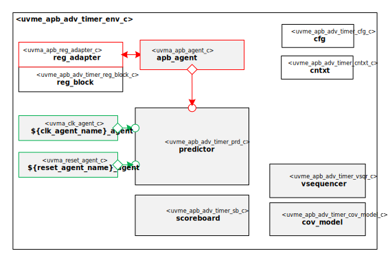

@mainpage IP Information
@htmlonly

@endhtmlonly

@tableofcontents

@section license_agreement License Agreement
© Copyright 2022 Datum Technology Corporation

All rights reserved.

@section ip_desc IP Description
This IP contains the Datum Technology Corporation APB Advanced Timer Sub-System UVM Environment.
TODO Describe APB Advanced Timer Sub-System UVM Environment

@section ip_documents Documents
ID | Name | Version
-- | ---- | -------
001 | @subpage quick_start_guide "Quick Start Guide" | v.1.0
002 | @subpage user_guide "User Guide" | v.1.0

@section ip_ref Reference
 * @ref uvme_apb_adv_timer_comps
 * @ref uvme_apb_adv_timer_obj
 * @ref uvme_apb_adv_timer_seq
 * @ref uvme_apb_adv_timer_reg
 * @ref uvme_apb_adv_timer_misc
 * @ref uvme_apb_adv_timer_pkg Typedefs

@section release_history Release History
@subsection v_1_0_0 2022/01/01 - v.1.0.0
- Initial release

@htmlonly

@endhtmlonly