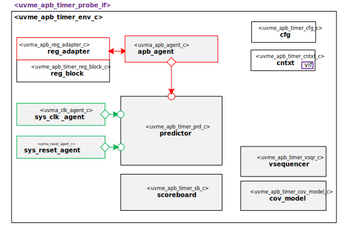

# Hello from your Code Generator!
Thank you for using the Moore.io Sub-System UVM Environment+TB Code Template v1.0!

Your parameters are:
* Name: 'apb_timer'
* Full Name: 'CORE-V MCU APB Timer'
* Clock Agent Name: 'sys_clk'
* Reset Agent Name: 'sys_reset'
* RAL Agent Type: 'apb'
* RAL Agent Name: 'apb'

If this is incorrect, it is recommended to delete the generated IP and re-generate with the correct parameters.

This code template assumes the DUT has a single apb interconnect interface, clock and reset.
The Predictor has example code for adding datapath prediction.
Sub-environments can be easily added by uncommenting the examples in the code.
The register model is empty but contains example code best used for small applications.
It is highly recommended to use a UVM Register Model generator.

use `grep -nr TODO .` for a full list of recommendations.

## Have fun!
Make sure to check out the other IP generated along with this environment:
* `uvmt_{{name }}`

# CORE-V MCU APB Timer Sub-System UVM Environment

# About
This IP contains the CORE-V MCU APB Timer Sub-System UVM Environment.

TODO Describe CORE-V MCU APB Timer

# Block Diagram

# Directory Structure
* `bin` - Scripts, metadata and other miscellaneous files
* `docs` - Reference documentation
* `examples` - Code samples for using and extending this environment
* `src` - Source code

# Dependencies
It is dependent on the following IP:

* `uvm`
* `uvml`
* `uvml_logs`
* `uvml_sb`
* `uvml_ral`
* `uvma_clk`
* `uvma_reset`
* `uvma_apb`
