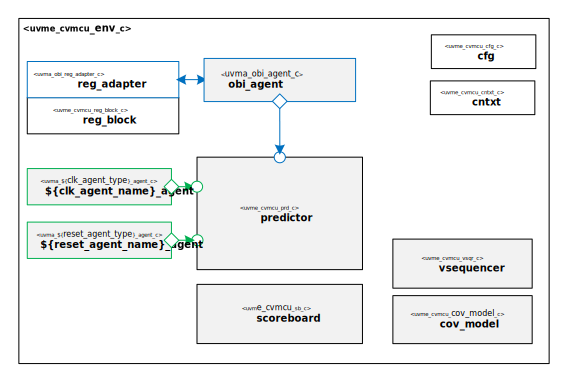

@page user_guide User Guide
@htmlonly

@endhtmlonly

@tableofcontents

@section license_agreement_ug License Agreement
© Copyright 2022-2023 Datum Technology Corporation

All rights reserved.

@section user_guide_id Document Information
ID | Name | Version
-- | ---- | -------
002 | User Guide | v.1.0

@subsection user_guide_description Description
This guide will walk you through integrating the CORE-V MCU Sub-System UVM Environment in your own UVM Environment and Test Bench.

@section user_guide_guide_revision_history Revision History
Revision  | Date | Description
--------- | ---- | -----------
1.0 | 2022/01/01 | Initial Version

@section user_guide_definitions Definitions
Symbol  | Description
--------- | -----------
 'PDM' | Please Define Me

@section user_guide_prerequisites Pre-Requisites
The Moore.io Client CLI, used throughout this tutorial is available via "pipx":
@code{.sh}pipx install mio-client@endcode

@section user_guide_guide_installation Installation
Install the CORE-V MCU Sub-System UVM Environment: @code{.sh}mio install uvme_cvmcu@endcode

@section user_guide_guide_todo Contents
TODO Finish the CORE-V MCU User Guide

@htmlonly

@endhtmlonly