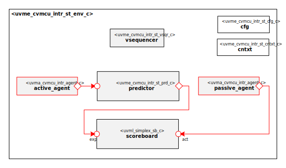

# Hello from your Code Generator!
Thank you for using the Moore.io Basic UVM Agent Code Template v1.0!

Your parameters are:
* Name: 'cvmcu_intr'
* Full Name: 'CORE-V MCU Interrupt'

If this is incorrect, it is recommended to delete the generated IP and re-generate with the correct parameters.

Use `grep -nr TODO .` for a full list of sample code for changes you can make to the environment.

## Have fun!
Make sure to check out the other IP generated along with this test bench:
* `uvma_cvmcu_intr`
* `uvmt_cvmcu_intr_st`

# Datum Technology Corporation CORE-V MCU Interrupt Agent Self-Test UVM Environment

# About
This IP contains the Datum Technology Corporation CORE-V MCU Interrupt Agent Self-Test UVM Environment.
Its main purpose is to test the CORE-V MCU Interrupt UVM Agent (`uvma_cvmcu_intr_pkg`) in isolation.

# Block Diagram

# Directory Structure
* `bin` - Scripts, metadata and other miscellaneous files
* `docs` - Reference documentation
* `examples` - Code samples for using and extending this environment
* `src` - Source code

# Dependencies
It is dependent on the following IP:

* `uvm`
* `uvml`
* `uvml_logs`
* `uvml_sb`
* `uvma_cvmcu_intr`
