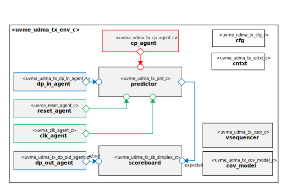

@page quick_start_guide Quick Start Guide
@htmlonly

@endhtmlonly

@tableofcontents

@section quick_start_license_agreement License Agreement
© Copyright 2022 Datum Technology Corporation

SPDX-License-Identifier: Apache-2.0 WITH SHL-2.1

@section quick_start_guide_id Document Information
ID | Name | Version
-- | ---- | -------
001 | Quick Start Guide | v.1.0

@subsection quick_start_guide_description Description
This document is a short guide to running the uDMA Tx Channels Block-Level UVM Environment in its own Test Bench.

@section quick_start_guide_revision_history Revision History
Revision  | Date | Description
--------- | ---- | -----------
1.0 | 2022/01/01 | Initial Version

@section quick_start_guide_definitions Definitions
Symbol | Definition
------ | ----------
 'ABC' | Always Be Closing

@section quick_start_guide_prerequisites Pre-Requisites
The Moore.io Client CLI, used throughout this tutorial is available via "pipx":
@code{.sh}pipx install mio-client@endcode

@section quick_start_guide_introduction Introduction
The uDMA Tx Channels UVM Environment has a Test Bench used to verify the uDMA Tx Channels Block thoroughly.
This guide will walk you through running a Test from this Test Bench.

@section quick_start_guide_installation Installation
1. Install the uDMA Tx Channels Block-Level Control Plane UVM Agent: @code{.sh}mio install uvma_udma_tx_cp@endcode
2. Install the uDMA Tx Channels Block-Level Data Plane Input UVM Agent: @code{.sh}mio install uvma_udma_tx_dp_in@endcode
3. Install the uDMA Tx Channels Block-Level Data Plane Output UVM Agent: @code{.sh}mio install uvma_udma_tx_dp_out@endcode
4. Install the uDMA Tx Channels Block-Level UVM Environment: @code{.sh}mio install uvme_udma_tx@endcode
5. Install the uDMA Tx Channels Block-Level UVM Test Bench: @code{.sh}mio install uvmt_udma_tx@endcode

@section quick_start_guide_compile_elaborate Compile and Elaborate
1. Compile the uDMA Tx Channels Block-Level UVM Test Bench: @code{.sh}mio sim uvmt_udma_tx -C@endcode
2. Elaborate the uDMA Tx Channels Block-Level UVM Test Bench with wave capture enabled: @code{.sh}mio sim uvmt_udma_tx -E -w@endcode

@section quick_start_guide_simulate Simulate
Launch uDMA Tx Channels Block-Level UVM Test "rand_stim" with seed "1":
@code{.sh}mio sim uvmt_udma_tx -S -t rand_stim -s 1@endcode

@section quick_start_guide_results Results
The Moore.io CLI will printout the commands to view both the simulation logs (don't forget to check out the "trn_log"
directory for transaction logs) and waveforms.

@section quick_start_guide_conclusion Conclusion
That's all for this short guide.  For more information, including integration, have a look at the @subpage user_guide "User Guide".

@htmlonly

@endhtmlonly
