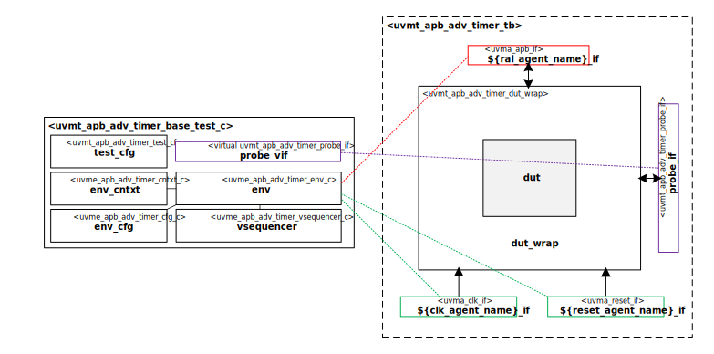

# Hello from your Code Generator!
Thank you for using the Moore.io Sub-System UVM Environment+TB Code Template v1.0!

Your parameters are:
* Name: 'apb_adv_timer'
* Full Name: 'CORE-V MCU APB Advanced Timer'
* Clock Agent Name: 'sys_clk'
* Reset Agent Name: 'sys_reset'
* RAL Agent Type: 'apb'
* RAL Agent Name: 'apb'

If this is incorrect, it is recommended to delete the generated IP and re-generate with the correct parameters.

This code template assumes the DUT has a single apb interconnect interface, clock and reset.

What follows is a short guide for developers of this new UVM Test Bench.  You may also use `grep -nr TODO .` for a full list.

## 1 - Connect the DUT to the Interfaces
 1. - [ ] IP Metadata - `ip.yml` - Use the sample code as a guide to add your DUT information.
 1. - [ ] DUT Wrapper - `tb/uvma_apb_adv_timer_dut_wrap.sv` - Use the sample code as a guide to instantiate your DUT and connect its ports.

## Have fun!
Make sure to check out the other IP generated along with this test bench:
* `uvme_apb_adv_timer`

# CORE-V MCU APB Advanced Timer Sub-System UVM Test Bench

# About
This IP contains the CORE-V MCU APB Advanced Timer Sub-System UVM Test Bench.

TODO Describe CORE-V MCU APB Advanced Timer

# Block Diagram

# Directory Structure
* `bin` - Scripts, metadata and other miscellaneous files
* `docs` - Reference documentation
* `examples` - Code samples for adding to this test bench
* `src` - Source code

# Dependencies
It is dependent on the following IP:

* `uvm`
* `uvml`
* `uvml_logs`
* `uvml_sb`
* `uvml_ral`
* `uvma_clk`
* `uvma_reset`
* `uvma_apb`
* `uvme_apb_adv_timer`
