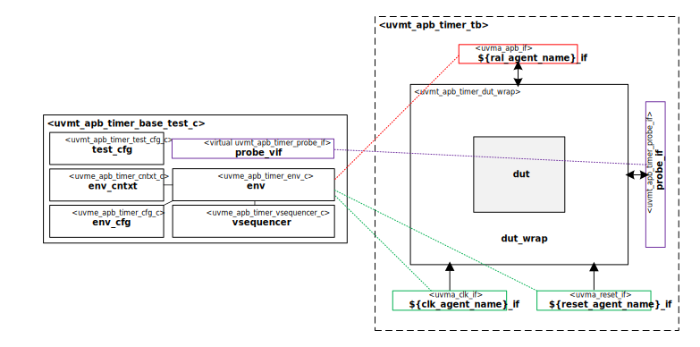

# APB Timer Sub-System UVM Test Bench

# About
This IP contains the APB Timer Sub-System UVM Test Bench.

# Block Diagram

# Regressions
| Name | Description |
| ---- | ----------- |
| `sanity` | Runs only a single known seed for a few basic tests. |
| `nightly` | Nightly bug hunt. |
| `weekly` | Weekly bug hunt. |
| `bugs` | Outstanding bugs. |

# Tests
| Name | Description |
| ---- | ----------- |
| [`mem_access`](src/tests/uvmt_apb_timer_mem_access_test.sv) | Ensures accessibility of all memories by executing the uvm_mem_single_access_seq sequence on each. |
| [`mem_walk`](src/tests/uvmt_apb_timer_mem_walk_test.sv) | Checks all memories by executing the uvm_mem_single_walk_seq sequence on each. |
| [`reg_access`](src/tests/uvmt_apb_timer_reg_access_test.sv) | Ensures accessibility of all registers by executing the uvm_reg_single_access_seq sequence on each. |
| [`reg_bit_bash`](src/tests/uvmt_apb_timer_reg_bit_bash_test.sv) | Checks the implementation of all registers by executing the uvm_reg_single_bit_bash_seq on each. |
| [`reg_hw_reset`](src/tests/uvmt_apb_timer_reg_hw_reset_test.sv) | Reads all of the registers, via all of the available address maps, comparing the value read with the expected reset value. |
| [`shared_access`](src/tests/uvmt_apb_timer_shared_access_test.sv) | Ensures accessibility of all registers by executing the uvm_reg_shared_access_seq sequence on each. |
| [`smoke`](src/tests/uvmt_apb_timer_smoke_test.sv) | Writes to a single memory location and reads back. |

# Directory Structure
* `bin` - Scripts, metadata and other miscellaneous files
* `docs` - Reference documentation
* `examples` - Code samples for adding to this test bench
* `src` - Source code

# Dependencies
It is dependent on the following IP:

* [`uvmx`](https://www.mooreio.com/catalog/1152)
* [`uvml_sb`](https://www.mooreio.com/catalog/1155)
* [`uvma_clk`](https://www.mooreio.com/catalog/1156)
* [`uvma_reset`](https://www.mooreio.com/catalog/1157)
* [`uvma_apb`](https://www.mooreio.com/catalog/1158)
* [`uvme_apb_timer`](../uvme_apb_timer)
