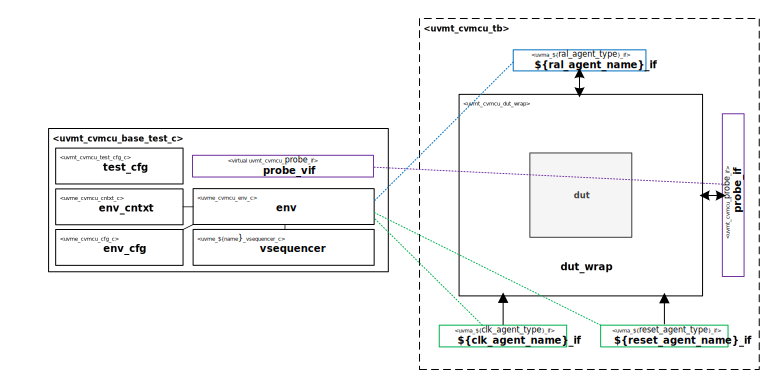

# CORE-V MCU UVM Test Bench

# About
This IP contains the CORE-V MCU UVM Test Bench.

# Block Diagram

# Directory Structure
* `bin` - Scripts, metadata and other miscellaneous files
* `docs` - Reference documentation
* `examples` - Code samples for adding to this test bench
* `src` - Source code

# Dependencies
It is dependent on the following IP:

* `uvmx`
* `uvml_sb`
* `uvma_clk`
* `uvma_reset`
* `uvma_obi`
* `uvme_cvmcu`
