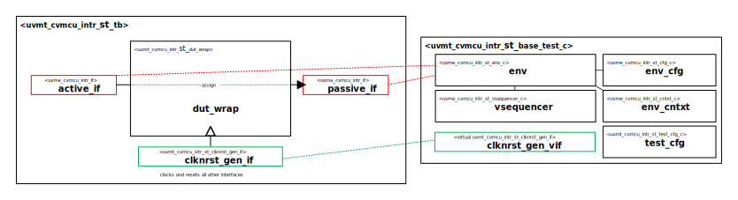

# Hello from your Code Generator!
Thank you for using the Moore.io Basic UVM Agent Code Template v1.0!

Your parameters are:
* Name: 'cvmcu_intr'
* Full Name: 'CORE-V MCU Interrupt'

If this is incorrect, it is recommended to delete the generated IP and re-generate with the correct parameters.

What follows is a short guide for developers of this new UVM Agent Self-Test Bench.  You may also use `grep -nr TODO .` for a full list.

## 1 - Connect the Interfaces
 1. - [ ] DUT Wrapper - `tb/uvma_cvmcu_intr_dut_wrap.sv` - Use the sample code as a guide to connect the active and passive interfaces.

## Have fun!
Make sure to check out the other IP generated along with this test bench:
* `uvma_cvmcu_intr`
* `uvme_cvmcu_intr_st`

# CORE-V MCU Interrupt Self-Test Bench and UVM Test Library

# About
This IP contains the CORE-V MCU Interrupt UVM Agent Self-Test Bench and Test Library.

# Block Diagram

# Directory Structure
* `bin` - Scripts, metadata and other miscellaneous files
* `docs` - Reference documentation
* `examples` - Code samples for adding to this test bench
* `src` - Source code

# Dependencies
It is dependent on the following IP:

* `uvm`
* `uvml`
* `uvml_logs`
* `uvml_sb`
* `uvma_cvmcu_intr`
* `uvme_cvmcu_intr_st`
