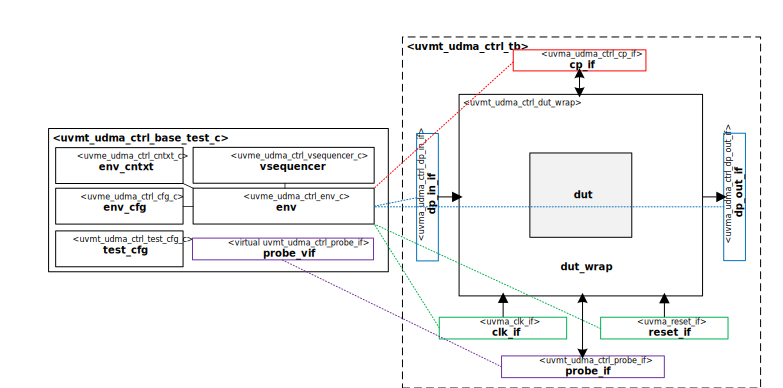

@mainpage IP Information
@htmlonly

@endhtmlonly

@tableofcontents

@section license_agreement License Agreement
© Copyright 2022 Datum Technology Corporation

SPDX-License-Identifier: Apache-2.0 WITH SHL-2.1

@section ip_desc IP Description
This IP contains the Datum Technology Corporation uDMA Controller Block UVM Test Bench.
TODO Describe uDMA Controller Block UVM Test Bench

@section ip_documents Documents
None

@section ip_ref Reference
 * @ref uvmt_udma_ctrl_tb
 * @ref uvmt_udma_ctrl_tests
 * @ref uvmt_udma_ctrl_misc
 * @ref uvmt_udma_ctrl_pkg Typedefs

@section release_history Release History
@subsection v_1_0_0 2022/01/01 - v.1.0.0
- Initial release

@htmlonly

@endhtmlonly